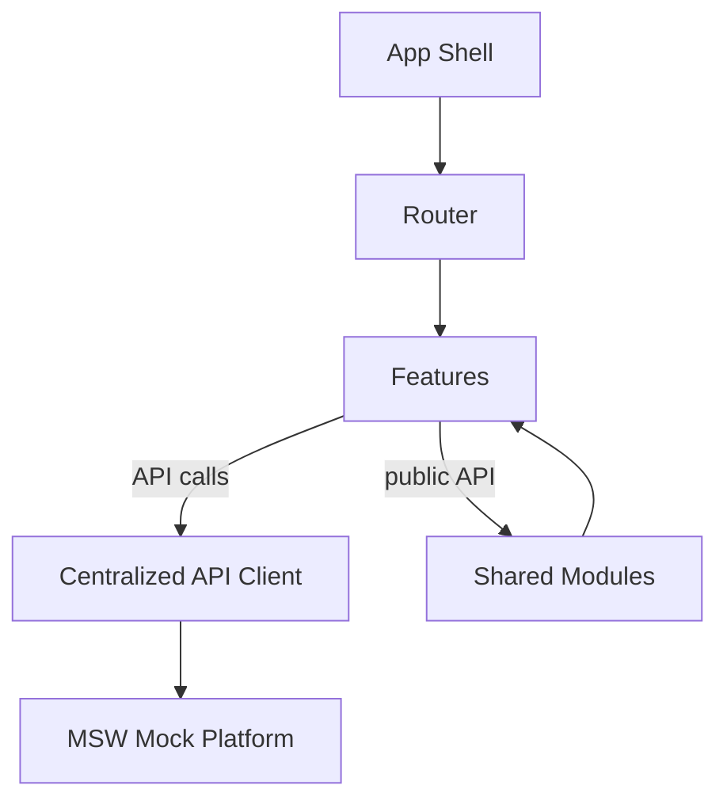

# Ecommerce Prototype

An modular React ecommerce prototype featuring strict domain boundaries, Material UI, local mocked APIs, and robust architecture for rapid development and testing.

---

## Table of Contents
- [Overview](#overview)
- [Product Features](#product-features)
- [Architecture Overview](#architecture-overview)
- [Folder Structure](#folder-structure)
- [Design Choices](#design-choices)
- [Setup & Local Development](#setup--local-development)
- [API & Data Layer](#api--data-layer)
- [Testing](#testing)
- [Deployment](#deployment)


---

## Overview
This project is a React ecommerce prototype built with:
- **React + TypeScript + Vite**
- **Material UI** for UI components
- **MSW** (Mock Service Worker) for local API mocking
- **Modular monolith** architecture with strict domain boundaries
- **PWA** support for offline browsing

The goal is to demonstrate best practices in frontend architecture, feature modularity, and developer experience.

---

## Product Features
- Product listing with search and category filter
- Product detail view
- Cart with add/remove/update quantity (optimistic UI, rollback on failure)
- Order history with pagination and cache invalidation
- Authentication with dummy credentials (`demo` / `demo123`)
- Centralized error handling and logging
- PWA app shell and offline product list browsing
- CI for linting and testing

---

## Architecture Overview

**Key Principles:**
- Modular monolith: Each feature is isolated with a public API
- Strict domain boundaries: No cross-feature imports except via public API
- Centralized API client: All network calls go through a single client with interceptors
- Mocked backend: All API calls are intercepted by MSW, with mock logic/data in `/mock` (never imported directly by features)
- Shared utilities/components live in `src/shared`

**Architecture Diagram:**



---

## Folder Structure

```text
.
├─ mock/
│  ├─ data/           # Mock data (products, users, cart, orders)
│  ├─ handlers/       # MSW request handlers
│  ├─ browser.ts      # MSW worker setup
│  └─ types.ts        # Mock entity types
├─ src/
│  ├─ app/            # App shell, router, providers
│  ├─ api/            # Centralized API client, error normalization
│  ├─ features/       # Feature modules (auth, products, cart, orders)
│  └─ shared/         # Shared components, logger, errors, hooks, types
└─ .github/workflows/ # CI workflows
```

---

## Design Choices
- **Material UI**: Consistent, accessible UI primitives
- **MSW**: Local API mocking for fast, reliable development
- **Centralized API client**: Handles auth, error normalization, logging
- **Feature public APIs**: Only public APIs are imported across features
- **Optimistic UI**: Cart updates are instant, with rollback on failure
- **PWA**: App shell and product list are available offline
- **CI**: Lint, test, and build checks on pull requests

---

## Setup & Local Development

### Prerequisites
- Node.js (see `package.json` for version)
- npm

### Getting Started
```sh
git clone <repo-url>
cd ecommerce-prototype
npm install
npm run dev
```

### Running with Mock Data
All API calls are intercepted by MSW. No backend setup is required.

### Running Tests & Lint
```sh
npm run lint
npm run test
```

### Building for Production
```sh
npm run build
```

---

## API & Data Layer
- All API calls use the centralized client (`src/api/client.ts`)
- Endpoints are mocked via MSW handlers in `mock/handlers`
- Mock data is in `mock/data` (never imported directly by features)
- Error responses are normalized to `{ code, message, status, details }`

**To add/modify endpoints:**
1. Update or add handler in `mock/handlers`
2. Update mock data in `mock/data` if needed
3. Update feature hooks/services to use the new endpoint

---

## Testing
- Unit tests: API error normalization, token interceptor, logger contract
- Integration tests: Auth, product list, cart optimistic updates, order pagination
- Error boundary tests

**Run all tests:**
```sh
npm run test
```

---

## Deployment
- Build with `npm run build`
- Deploy static output (e.g., Vercel, Netlify)
- Configure environment variables in `.env.*` files:
  - `VITE_API_BASE_URL`
  - `VITE_ENABLE_MOCKS`
  - `VITE_LOG_LEVEL`

---
